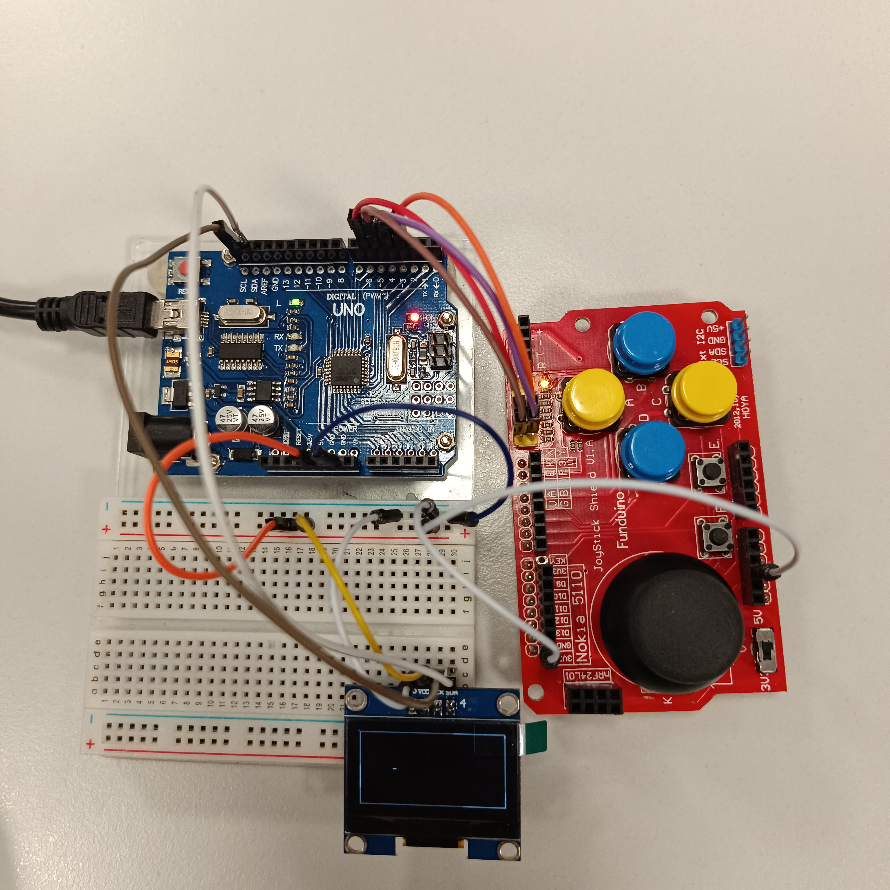
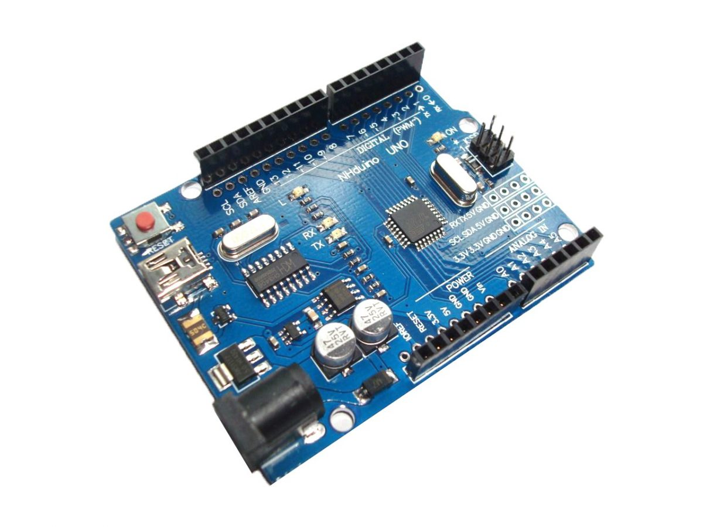
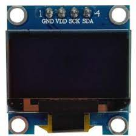
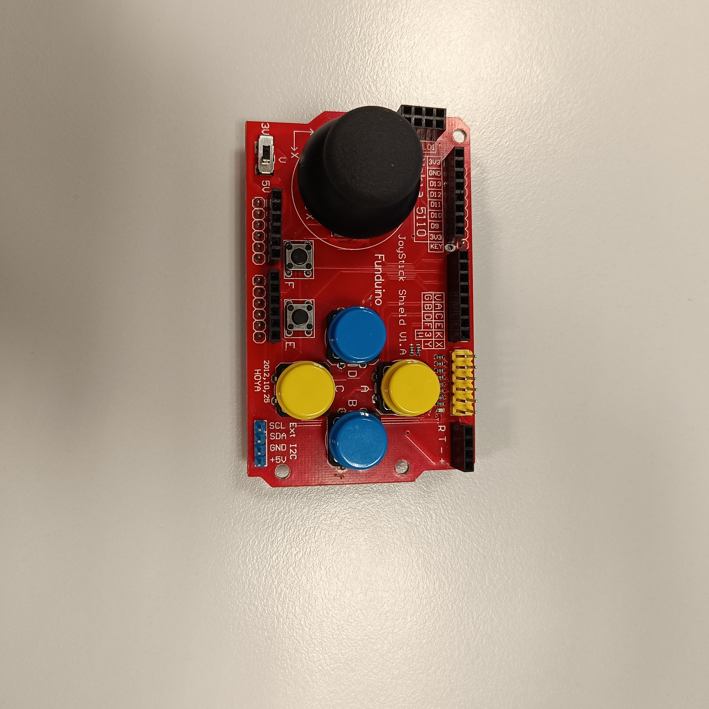
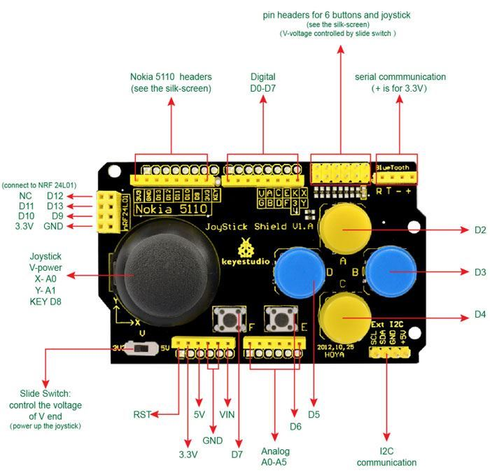
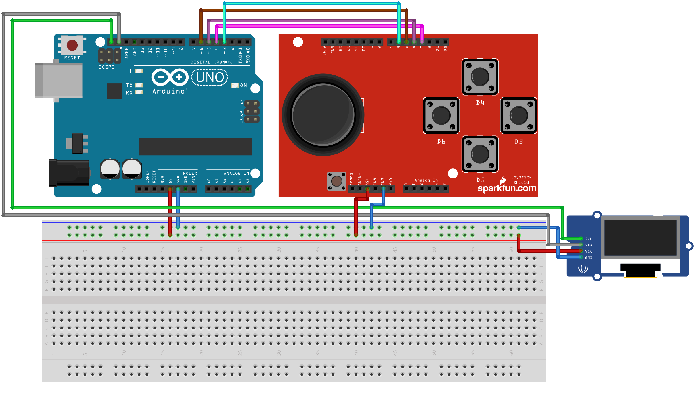
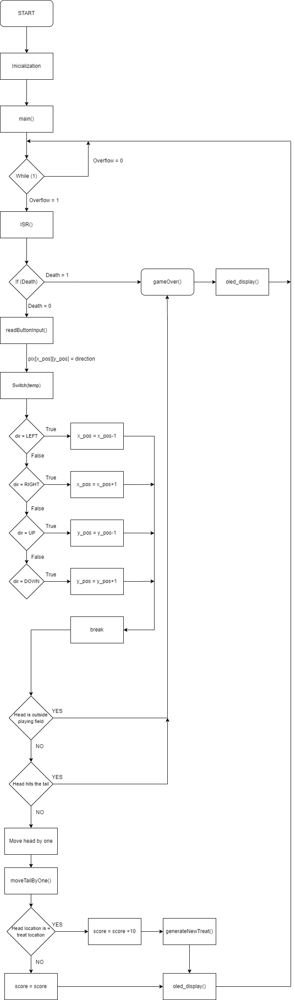
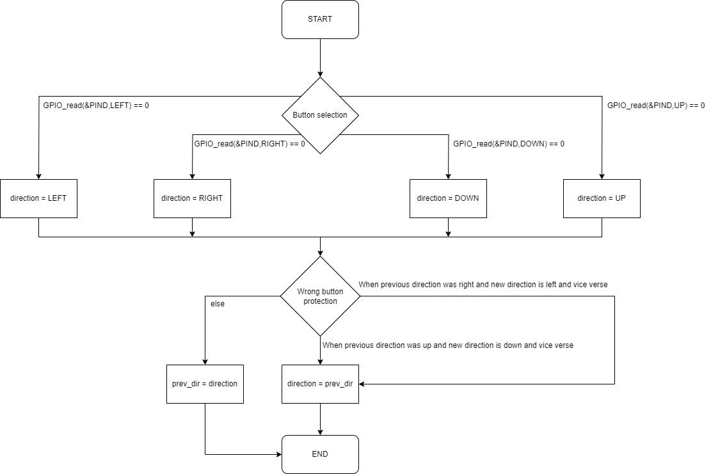
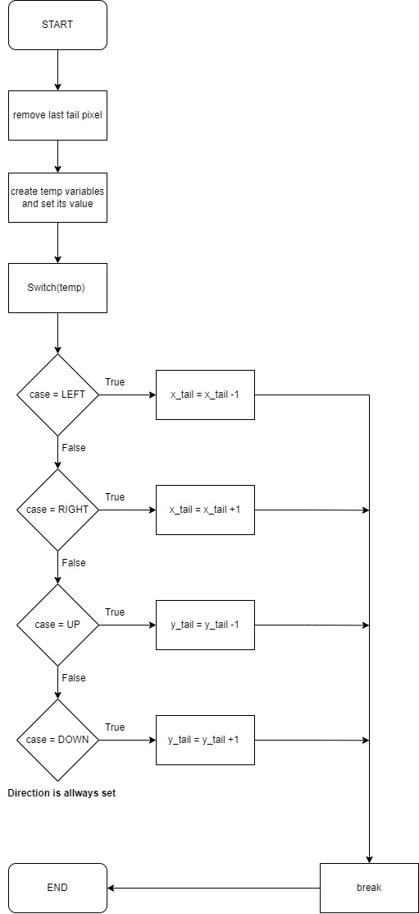
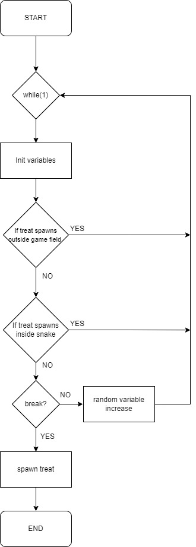

# DE2- Projekt Snake game

### Členové týmu

* Marek IVAN
* Petr KAPLAN
* Miroslav TRCHALÍK
* Dominik EIS

## Theoretical description

 
Cílem naší práce bylo vytvořit zabávnou arkádovou hru Had. K tomu je zapotřebí využít Arduino Uno board s ATmega328P microcontroler, které obsahuje námi napsaný kód, jenž obsahuje řešení problémů k úspěšné funkčnosti hada. Dále potřebujeme OLED display 128x64, na kterém se tato minihra vykresluje a nakonec máme sadu čtyř tlačítek, která určuje směr pohybu hada. Namísto 4 tlačítek jsme měli v plánu vytvořit vlastní desku s tlačítky a joystickem. Ve finále jsme využili Joystick Shield Gamepad pro Arduino, které vyřešilo naši potřebu pro tvorbu vlastní desky. První problém, který jsme řešili bylo ,jak vykresli hada? Inspirovali jsme se řešením ze šestého cvičení z laboratoří. Za chvíli se nám podařilo vykreslit hada a arénu,v níž se odehrává hra. Poté bylo zapotřebí vyzkoušet funkčnost tlačítek, opět jsme se inspirovali cvičením tentokrát pátým, kde jsme kontrolovali funkčnost tlačítek pomocí UART. Za třetí následoval problém s vykreslením ovoce, které chce had zkonzumovat pro jeho růst a navýšení skóre. A tak vzniklo magické číslo, kterým se násobí číslem portu, podle stiknutého tlačítka pro pohyb. Funkce náhodně vygeneruje souřadnice X a Y, tyto souřadnice odpovídají pozici ovoce v herní ploše. Také jsme vyřešili, aby nenastalo, že se ovoce objeví mimo herní plochu. Největší problém spočíval v časovači. Ten s námi nechtěl spolupracovat, ale nakonec se nám jej povedlo do určité míry zprovoznit. Pohyb hada jsme vyřešili, pomocí pole, kde jsou nastaveny -1, pokud se v tomto pixelu nenachází nějaká část hada, naopak pixel bude mít hodnotu 3,4,5 nebo 6 (podle směru hada) , pokud se zde had nachází. Dále jsme řešili problémy, jako například, aby změna pohybu hada mohla být, pouze ta,kde by nenastalo, že had se otočí sám do sebe. A nakonec podmínky, kdy nastane "Game Over". To se stane v případě, když had narazí do svého ocasu nebo do zdi arény. Po smrti hada vyskočí obrazovka oznamující konec hry a skóre hráče.

## Hardware description
### Arduino Uno board
 Pro funkci, celého programu využíváme Arduino Uno board s ATmega328P microcontroler.

 
Arduino Uno je mikrokontrolérová deska založená na čipu ATmega328P. Má 14 digitálních vstupně/výstupních pinů (z toho 6 lze použít jako výstupy s PWM), 6 analogových vstupů, 16 MHz keramický rezonátor (CSTCE16M0V53-R0), USB připojení, napájecí konektor, ICSP hlavičku a tlačítko pro reset. Obsahuje všechno potřebné pro podporu mikrokontroléru; jednoduše lze připojit k počítači pomocí USB kabelu nebo napájet adaptérem AC-to-DC nebo baterií.
### Oled Display 128x64

 
Tento grafický OLED displej s rozlišením 128x64 je vhodný pro různé projekty. OLED displej má nízkou spotřebu, protože u OLED displeje svítí pouze ty body, které jsou aktivovány a nepotřebuje tím pádem podsvětlení. OLED displej obsahuje řídící obvod SSD1306, který komunikuje přes sběrnici I2C a použití s Arduinem/Raspberry/Beaglebone či jinými mikrokontrolery je velmi jednoduché.
### Joystick Shield Gamepad

 
Joystick Shield je rozšiřující modul, se kterým lze změnít Arduino v herní konzoli. Tento vstupní modul umožňuje vytvořit z Arduino desky herní ovladač, který slouží pro různé aplikace, Arduino projekty, pohyb v menu a také k plynulému ovládání vašeho robota pomocí joysticku - (v osách X a Y).Tento Arduino Shield obsahuje mnoho vstupních prvků - tlačítka, analogový joystick, přepínač mezi napětím 3,3 a 5 V a několik konektorů pro připojení dalších zařízení. Na Shieldu se nacházejí 4 větší tlačítka, 2 menší tlačítka a poslední tlačítko se nachází v joysticku (aktivace při stisknutí joysticku). Součástí Arduino Shieldu jsou také konektory pro: displej Nokia 5110 a pro připojení bezdrátového modulu nRF24L01. Použití Shieldu je velmi jednoduché - stačí jen nasadit na Arduino UNO, MEGA 2560 nebo další Arduino desky.
 
### Schéma zapojení

## Software description
### main.c flowchart:

 
[main.c soubor](https://github.com/marek8l/DE2/blob/main/projektsnake/src/main.c)
### Flowchart pro funkci readButtonInput:

### Flowchart pro funkci moveTailByOne:

### Flowchart pro funkci generateNewTreat:

## Instructions

NAPSAT MANUÁL A UDĚLAT VIDEO
Write an instruction manual for your application, including photos and a link to a short app video.

## References

1. (https://www.neon-el.cz/joystick-shield-gamepad-pro-arduino)https://www.neon-el.cz/joystick-shield-gamepad-pro-arduino
2. https://www.youtube.com/watch?v=O22KN90N-gE
3. https://github.com/tomas-fryza/digital-electronics-2/tree/master
4. https://stackoverflow.com/
5. https://store.arduino.cc/products/arduino-uno-rev3
6. https://pajenicko.cz/graficky-oled-displej-0-dot-96-128x64-i2c-modry
7. https://www.hadex.cz/m520d-joystick-shield-gamepad-pro-arduino/
   
